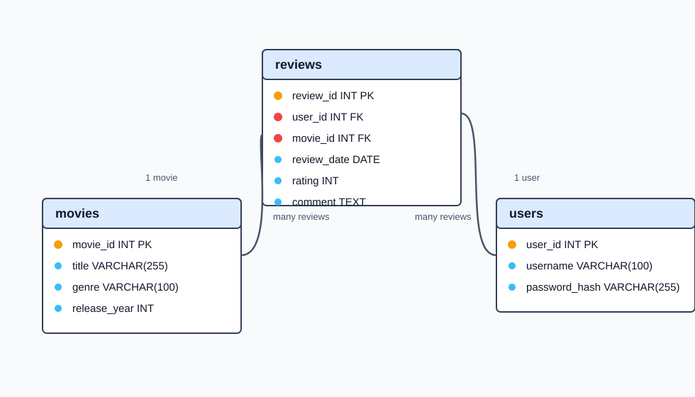
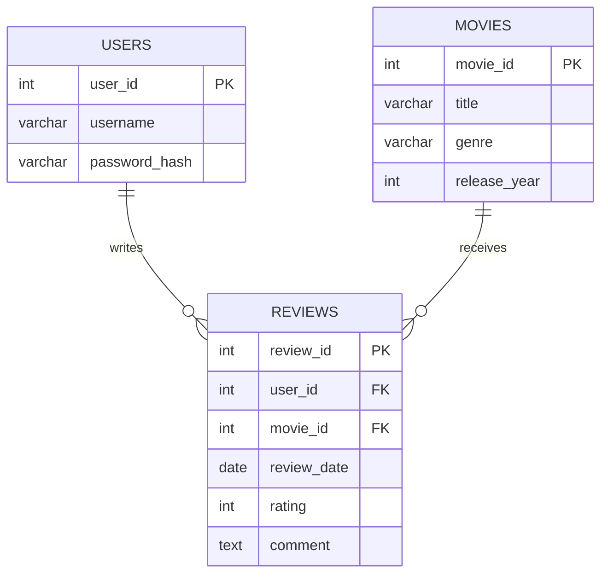

# Movie Review API

Movie Review API on Node.js-, Express- ja MySQL-teknologioilla rakennettu REST API elokuva-arvostelusovellukselle. Sovellus on toteutettu MVC-arkkitehtuurilla, ja sen avulla voidaan hallita käyttäjiä, elokuvia ja elokuva-arvosteluja.

Sovelluksessa käyttäjä voi rekisteröityä, kirjautua sisään ja käyttää suojattuja reittejä JWT-tokenin avulla. Salasanat tallennetaan tietokantaan bcryptillä kryptattuina.

## Teknologiat

- Node.js
- Express
- MySQL / MariaDB
- MVC-arkkitehtuuri
- JWT authentication
- bcrypt password hashing
- dotenv
- mysql2
- cors
- Postman

## Toiminnallisuus

Sovellus täyttää CRUD-vaatimukset:

- Create: uusien elokuvien, arvostelujen ja käyttäjien lisääminen
- Read: elokuvien ja arvostelujen hakeminen
- Update: elokuvien ja arvostelujen päivittäminen
- Delete: elokuvien ja arvostelujen poistaminen

Käyttäjä kirjautuu sisään JWT-tokenilla. Token vaaditaan kaikissa `/movies` ja `/reviews` reiteissä.

## Tietokanta

Tietokannan nimi:

```text
movie_review_db
```

Taulut:

- `users`
- `movies`
- `reviews`

Relaatiot:

- yksi käyttäjä voi kirjoittaa monta arvostelua
- yksi elokuva voi saada monta arvostelua
- `reviews`-taulu liittyy sekä `users`- että `movies`-tauluun viiteavaimilla

Viiteavaimet:

```text
reviews.user_id -> users.user_id
reviews.movie_id -> movies.movie_id
```

Viiteavaimissa käytetään:

```text
ON DELETE CASCADE
ON UPDATE CASCADE
```

## ER-Diagrammi





## Stored Procedure

Tietokannassa on MySQL-aliohjelma:

```text
GetMovieReviews(movieId)
```

Se hakee valitun elokuvan arvostelut ja palauttaa:

- elokuvan nimen
- käyttäjänimen
- arvosanan
- kommentin
- arvostelupäivämäärän

Endpoint:

```text
GET /movies/:id/reviews
```

## API-Reitit

### Auth

```text
POST /auth/register
POST /auth/login
```

### Movies

Kaikki `/movies` reitit vaativat Bearer tokenin.

```text
GET /movies
GET /movies/:id
POST /movies
PUT /movies/:id
DELETE /movies/:id
GET /movies/:id/reviews
```

### Reviews

Kaikki `/reviews` reitit vaativat Bearer tokenin.

```text
GET /reviews
POST /reviews
PUT /reviews/:id
DELETE /reviews/:id
```

Arvostelua lisättäessä `user_id` otetaan JWT-tokenista, ei request bodysta.

## Esimerkkipyynnöt

### Register

```http
POST http://localhost:3000/auth/register
```

```json
{
  "username": "matti",
  "password": "salasana123"
}
```

### Login

```http
POST http://localhost:3000/auth/login
```

```json
{
  "username": "matti",
  "password": "salasana123"
}
```

Login palauttaa JWT-tokenin. Suojattuihin reitteihin lisätään header:

```text
Authorization: Bearer <token>
```

### Create Movie

```http
POST http://localhost:3000/movies
```

```json
{
  "title": "Inception",
  "genre": "Sci-Fi",
  "release_year": 2010
}
```

### Create Review

```http
POST http://localhost:3000/reviews
```

```json
{
  "movie_id": 1,
  "rating": 5,
  "comment": "Indiana Jones on kestoklassikko, jonka pariin palaa aina uudestaan."
}
```

## Testidata

Testidata löytyy tiedostosta:

```text
sql/reset_seed.sql
```

Testidata lisää:

- 5 käyttäjää
- 7 elokuvaa
- 9 arvostelua

Käyttäjät:

```text
matti / salasana123
liisa / salasana124
pekka / salasana125
anna  / salasana126
sari  / salasana127
```

## Asennus ja käynnistys

1. Kloonaa projekti GitHubista.
2. Asenna riippuvuudet:

```bash
npm install
```

3. Luo `.env`-tiedosto `.env.example`-tiedoston pohjalta:

```env
DB_HOST=localhost
DB_USER=root
DB_PASSWORD=oma_mysql_salasana
DB_NAME=movie_review_db
JWT_SECRET=oma_salainen_avain
PORT=3000
```

4. Luo tietokanta ja taulut ajamalla phpMyAdminissa:

```text
sql/schema.sql
```

5. Lisää testidata ajamalla phpMyAdminissa:

```text
sql/reset_seed.sql
```

6. Käynnistä sovellus:

```bash
npm start
```

API käynnistyy osoitteeseen:

```text
http://localhost:3000
```

## Testaus

API on testattu Postmanilla. Testauksessa tarkistettiin:

- käyttäjän rekisteröinti
- käyttäjän kirjautuminen
- JWT-tokenin käyttö suojatuilla reiteillä
- elokuvien CRUD-operaatiot
- arvostelujen CRUD-operaatiot
- stored proceduren endpoint `GET /movies/:id/reviews`

## Esittelyvideo

Esittelyvideon linkki:

```text
Lisää tähän esittelyvideon linkki
```
