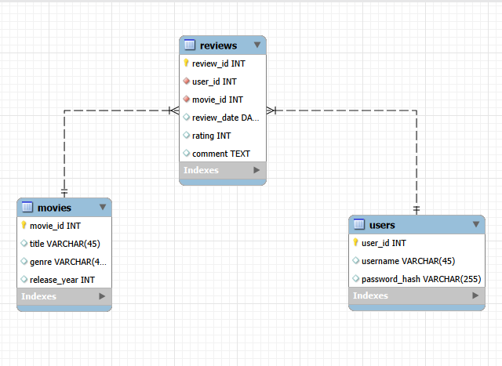

# Movie Review 

Tämä on tietokannat ja rajapinnat kurssin harjoitustyö

Työhön pystyvät eri käyttäjät lisäämään elokuvia ja arvosteluja niille.

Sovelluksessa käyttäjä voi rekisteröityä, kirjautua sisään ja käyttää suojattuja reittejä JWT-tokenin avulla. Salasanat tallennetaan tietokantaan bcryptillä kryptattuina.

# työssä käytetyt teknologiat

- Node.js
- Express
- MySQL
- MVC-arkkitehtuuri
- JWT authentication
- bcrypt password hashing
- dotenv
- mysql2
- Postman

# Toiminnallisuus

Sovellus täyttää CRUD-vaatimukset:

- Create: uusien elokuvien, arvostelujen ja käyttäjien lisääminen
- Read: elokuvien ja arvostelujen hakeminen
- Update: elokuvien ja arvostelujen päivittäminen
- Delete: elokuvien ja arvostelujen poistaminen

Käyttäjä kirjautuu sisään JWT-tokenilla. 

## Tietokanta

Tietokannan nimi:

```text
movie_review_db
```

Taulut:

- `users`
- `movies`
- `reviews`

Relaatiot:

- yksi käyttäjä voi kirjoittaa monta arvostelua
- yksi elokuva voi saada monta arvostelua
- `reviews`-taulu liittyy sekä `users`- että `movies`-tauluun viiteavaimilla


## ER-Diagrammi



## Stored Procedure

Tietokannassa on MySQL-aliohjelma:

```text
GetMovieReviews(movieId)
```

Se hakee valitun elokuvan arvostelut ja palauttaa:

- elokuvan nimen
- käyttäjänimen
- arvosanan
- kommentin
- arvostelupäivämäärän

Endpoint:

```text
GET /movies/:id/reviews
```

## API-Reitit

### Auth

```text
POST /auth/register
POST /auth/login
```

### Movies

Kaikki `/movies` reitit vaativat Bearer tokenin.

```text
GET /movies
GET /movies/:id
POST /movies
PUT /movies/:id
DELETE /movies/:id
GET /movies/:id/reviews
```

### Reviews

Kaikki `/reviews` reitit vaativat Bearer tokenin.

```text
GET /reviews
POST /reviews
PUT /reviews/:id
DELETE /reviews/:id
```

Arvostelua lisättäessä `user_id` otetaan JWT-tokenista, ei request bodysta.


## Testidata

Testidata löytyy tiedostosta:

```text
sql/reset_seed.sql
```

Testidata lisää:

- 5 käyttäjää
- 7 elokuvaa
- 9 arvostelua

Käyttäjät:

```text
matti / salasana123
liisa / salasana124
pekka / salasana125
anna  / salasana126
sari  / salasana127
```


## Testaus

API on testattu Postmanilla. Testauksessa tarkistettiin:

- käyttäjän rekisteröinti
- käyttäjän kirjautuminen
- JWT-tokenin käyttö suojatuilla reiteillä
- elokuvien CRUD-operaatiot
- arvostelujen CRUD-operaatiot
- stored proceduren endpoint `GET /movies/:id/reviews`

## Esittelyvideo

Esittelyvideon linkki:

```text
Video lisätään README-tiedostoon ennen Moodle-palautusta.
```
